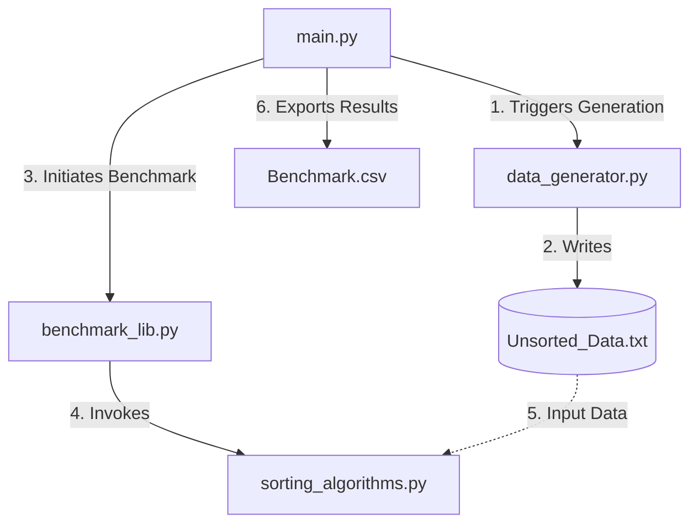

## Project Overview

This repository contains the source code, datasets, and experimental results for a comparative study of sorting algorithms. The project evaluates the computational efficiency of manual Python implementations (QuickSort, HeapSort, MergeSort) against the optimized `numpy.sort` library across various data distributions and types.

## Repository Architecture

This section details the purpose and functionality of each file within the repository, categorized by their role in the experimental pipeline.

### 1. Core Logic & Algorithms

* **`sorting_algorithms.py`**
* **Role:** The algorithmic core of the project.
* **Description:** Contains the pure Python implementations of the three sorting algorithms under test:
* `quick_sort`: Recursive Divide and Conquer implementation.
* `heap_sort`: Binary Heap-based sorting.
* `merge_sort`: Recursive Merge Sort implementation.

* **Usage:** This module is imported by the benchmarking library to execute the sorting tasks.

### 2. Experiment Control & Utility

* **`main.py`**
* **Role:** The entry point (Orchestrator) of the application.
* **Description:** This script manages the high-level workflow of the experiment. It coordinates the data loading process, initializes the benchmarking routines, and formats the final output.
* **Dependencies:** Imports `data_generator`, `sorting_algorithms`, and `benchmark_lib`.

* **`benchmark_lib.py`**
* **Role:** The measurement and metrics engine.
* **Description:** Provides the wrapper functions responsible for:
* Timing the execution of each algorithm using high-precision timers.
* Managing memory and execution contexts for consistent testing.
* Aggregating results into a structured format for analysis.

* **`data_generator.py`**
* **Role:** Data synthesis and handling.
* **Description:** Responsible for generating large arrays of randomized, sorted, or reverse-sorted data (Integers and Floats). It handles the I/O operations required to serialize these datasets to disk or load them into memory for the experiment.

### 3. Data & Artifacts

* **`Unsorted_Data_compressed.zip`**
* **Role:** Raw experimental dataset.
* **Description:** A compressed archive containing the large-scale input files used for benchmarking.
* **Note:** Due to GitHub's file size limits, the raw `.txt` or binary data files are archived here. The system may require extraction of this archive before running tests on the full dataset.

* **`Benchmark.csv`**
* **Role:** Output / Result Log.
* **Description:** The persistent record of the experiment's findings. This file contains the recorded execution times arranged in tabular format (Algorithm vs. Dataset constraints), serving as the basis for the final performance report.

## Module Interdependencies

The following workflow illustrates how the files interact during runtime:

1. **Initialization**: `main.py` is executed.
2. **Data Provisioning**: `main.py` calls `data_generator.py` to either generate new test vectors or load existing data from the unzipped dataset.
3. **Execution Loop**:
* `main.py` passes the data to `benchmark_lib.py`.
* `benchmark_lib.py` sequentially invokes the algorithms defined in `sorting_algorithms.py` (and `numpy`).
* Execution time is captured for each iteration.

4. **Reporting**: Results are returned to `main.py`, which then exports the final metrics to `Benchmark.csv`.

